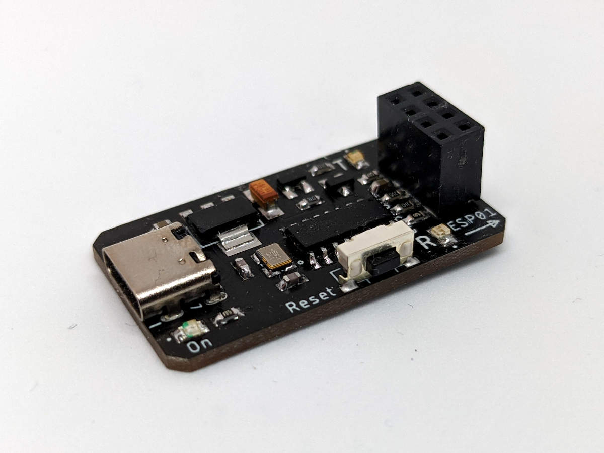
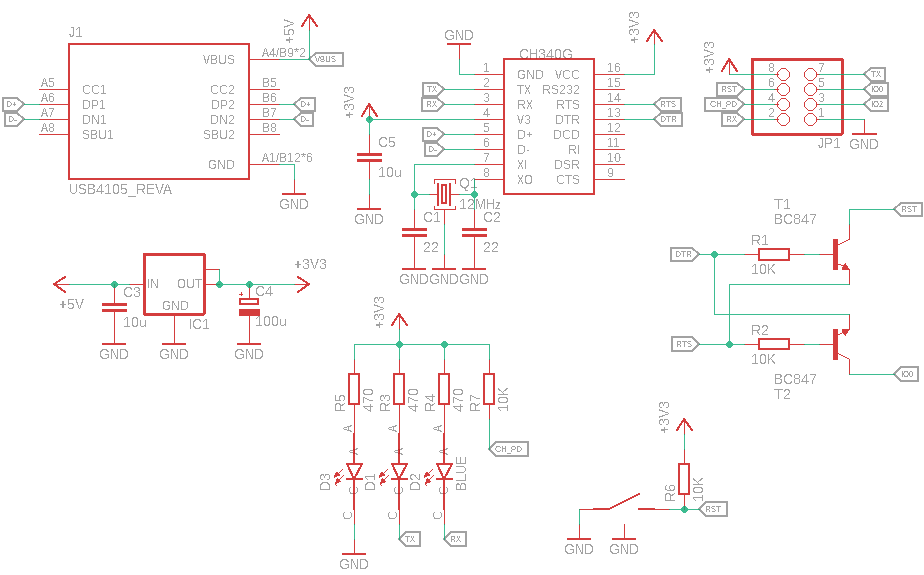
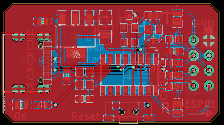

# CH340G programmer for ESP8266/ESP32

Programming device for ESP8266/ESP32 microcontrollers with proper BOOT/RST cirquitry and +3.3V power output.

More info in my blog [https://en.ovcharov.me/2019/08/16/ch340g-programmer-for-esp8266-esp32/](https://en.ovcharov.me/2019/08/16/ch340g-programmer-for-esp8266-esp32/).

## Update log

**Updated 2020/12/21** Added USB Type C connector and changed header pinout for compatibility with ESP01e
